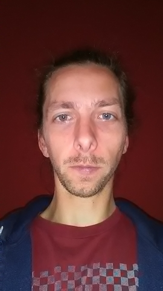

# Willem De Troyer

*“I have not failed. I've just found 10,000 ways that won't work.”*
― Thomas A. Edison

## I always (tend to) look on the bright side of life

 question | answer
  -|-
 Birthday | 02/02/1985 
 Favorite color | morning sky blue 
 Favorite food | Fresh salads 
 Pineapple on pizza | &#9745; no &#9744; yes |

## Hobbies
- Music
  - drums
  - saxophone
  - bass guitar
- Cycling

### You can always count on me for an honest opinion

## A funny story

When I was little my brother and I loved watching the Teenage Mutant Ninja Turtles. We liked 
playing like if we where them. One day we wanted to climb out of the window 
with a rope with a hook attached to it. We made the hook ourselves from an 
iron wire. Not such a good idea since we were able to bend it. Conclusion, we fell out of the window.

### TL;DR

"I'll better do it myself" doesn't always apply.

<< [previous](https://github.com/WendyStoop/markdown-challenge)|| Willem || [next](https://github.com/chevtong/markdown-challenge) >>